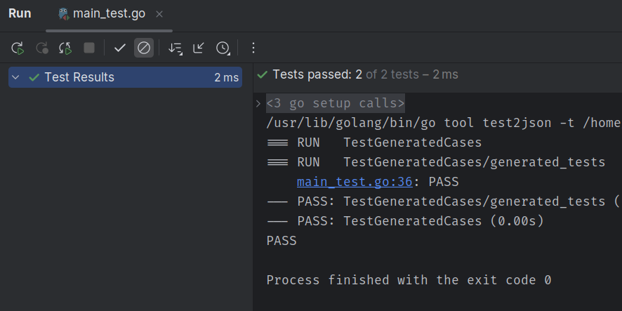

# Password Cracker
The app should hash each password from known passwords list and compare it to the hash passed into the function.

## Usage
Just run the main.go file, and it will print out the password that was found.
```go
go run main.go
```

